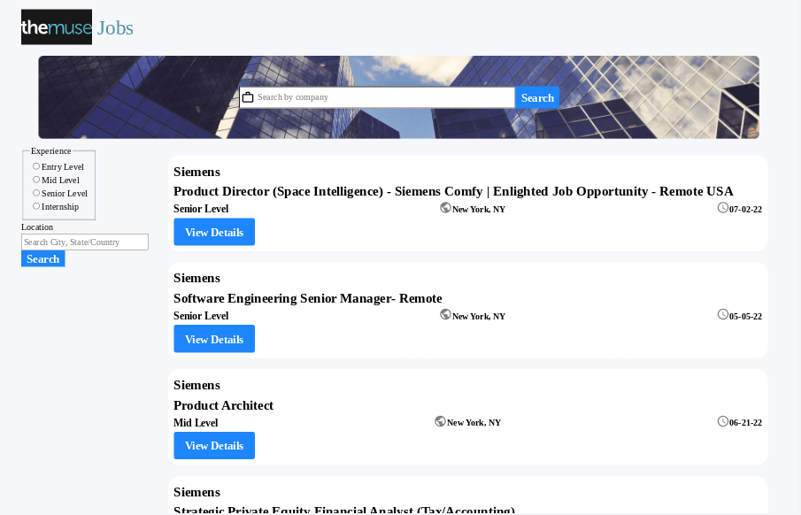
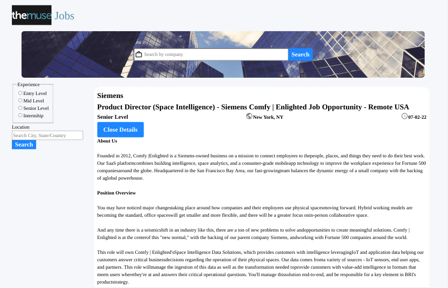
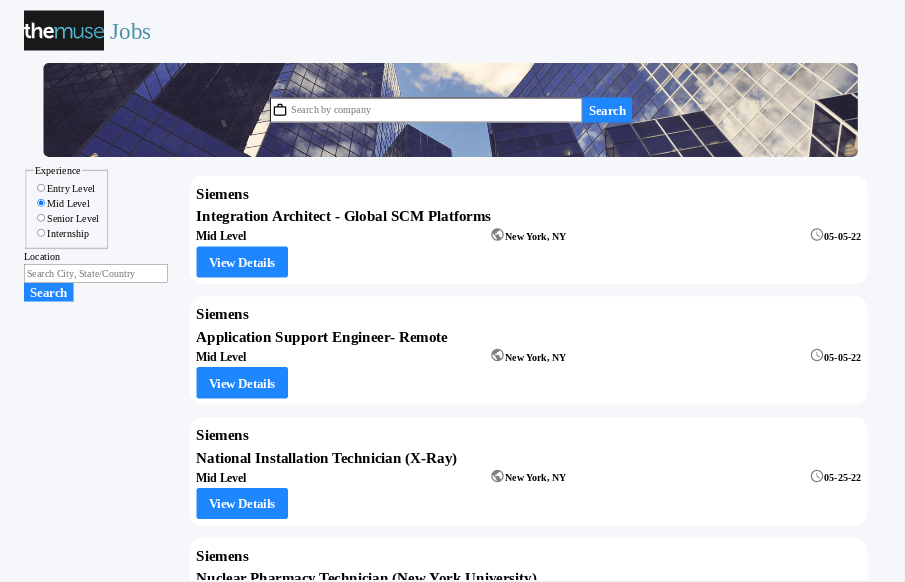
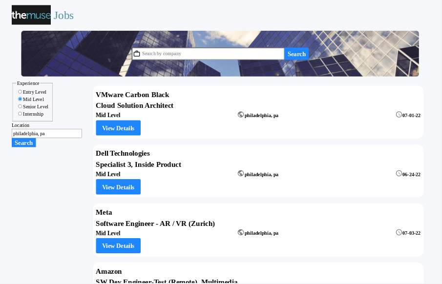
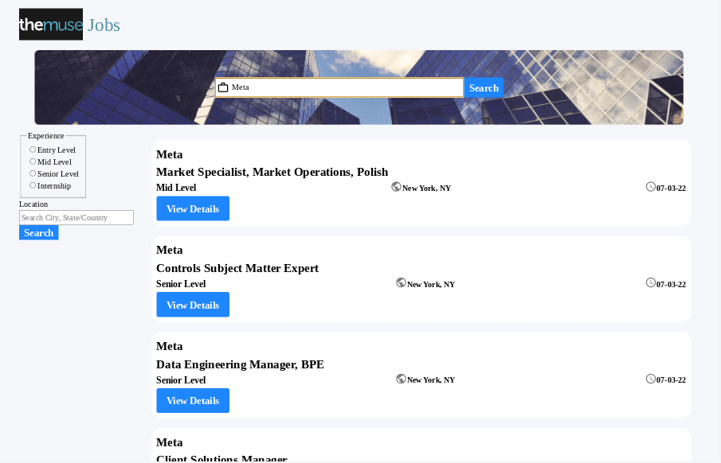
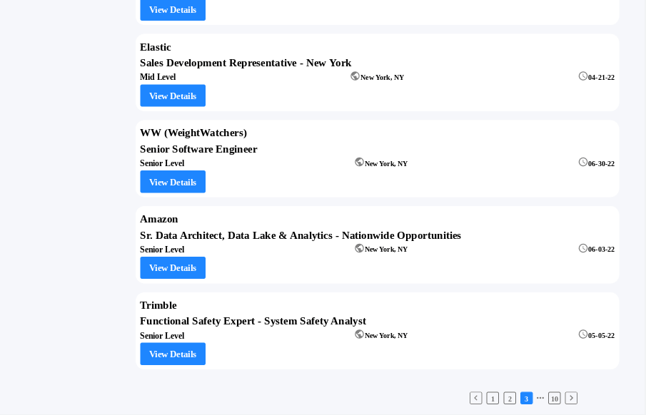
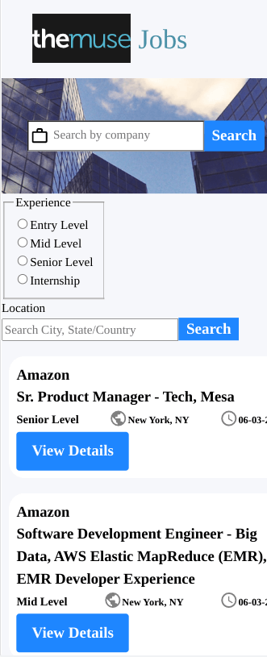

<h1 align="center">Muse Jobs App</h1>

   Solution for a challenge from  <a href="https://devchallenges.io/challenges/TtUjDt19eIHxNQ4n5jps" target="_blank">Devchallenges.io</a>.

## Table of Contents

- [Overview](#overview)
  - [Built With](#built-with)
- [Features](#features)
- [How to use](#how-to-use)
- [Useful Resources](#useful-resources)

## Overview

### Built With

- [Create React App](https://github.com/facebook/create-react-app).
- [React](https://reactjs.org/)
- [Interweave](https://interweave.dev/)
- [Date-fns](https://date-fns.org/)
- [themuse](https://www.themuse.com/developers/api/v2)

## Features

This application/site was created as a submission to a [DevChallenges](https://devchallenges.io/challenges) challenge. The [challenge](https://devchallenges.io/challenges/TtUjDt19eIHxNQ4n5jps) was to build an application to complete the given user stories.

## Thoughts

- Probably could have avoided using date-fns but I wanted to look into it more as it is extremely popular.
- First time using Interweave, it was recommended in this [stack overflow](https://stackoverflow.com/questions/29044518/safe-alternative-to-dangerouslysetinnerhtml) post.  I think it fit perfectly here and it is really simple to use.  
- I added the job description to the post itself vs adding react-router and crafting a detail page component.
- The Muse Jobs API has gone public (no api key) and it helped me approximate the intended devchallenge design. 
- Couldn't add all the search variables to one api request.  While level and location can be null, company and category cannot.  Without a page element, you get no response at all.  
- I thought about adding category at one point but ultimately, I left it out.
- I added a matching object for the company values so I wouldn't have a problem when sending the request.  
- I used JavaScript to get all the select values from the muse website and formatted it with online formatter.  When you grab it, every value is on its own line.
- The [Muse docs](https://www.themuse.com/developers/api/v2) have all accepted values listed.  
- I kinda faked the pagination at the bottom.  I don't have the numbers update (if you go past page 10) and the ellipsis doesn't bring up an input to type a specific page number.  It would be better to visually indicate what page you are on.  Might require state.  
- Problems if you search for same company in different locations 
- Global state management might be necessary to clean up and fix issues.  

## Useful Resources

- [Blog](https://dmitripavlutin.com/javascript-fetch-async-await/) - fetch with async and await
- [Stack Overflow](https://stackoverflow.com/questions/64362242/how-to-format-date-with-date-fns) - format date with date-fns
- [Stack Overflow](https://stackoverflow.com/questions/41691386/parsing-single-user-input-string-for-advanced-search-criteria) - parsing user input string for search
- [Stack Overflow](https://stackoverflow.com/questions/29044518/safe-alternative-to-dangerouslysetinnerhtml) - alternative to dangerouslysetinnerhtml
- [PluralSight](https://www.pluralsight.com/guides/how-to-use-radio-buttons-in-reactjs) - radio buttons in react
- [Blog](https://bobbyhadz.com/blog/javascript-includes-case-insensitive) - case insensitive includes
- [Github](https://gist.github.com/ffoodd/000b59f431e3e64e4ce1a24d5bb36034) - sr only implementation